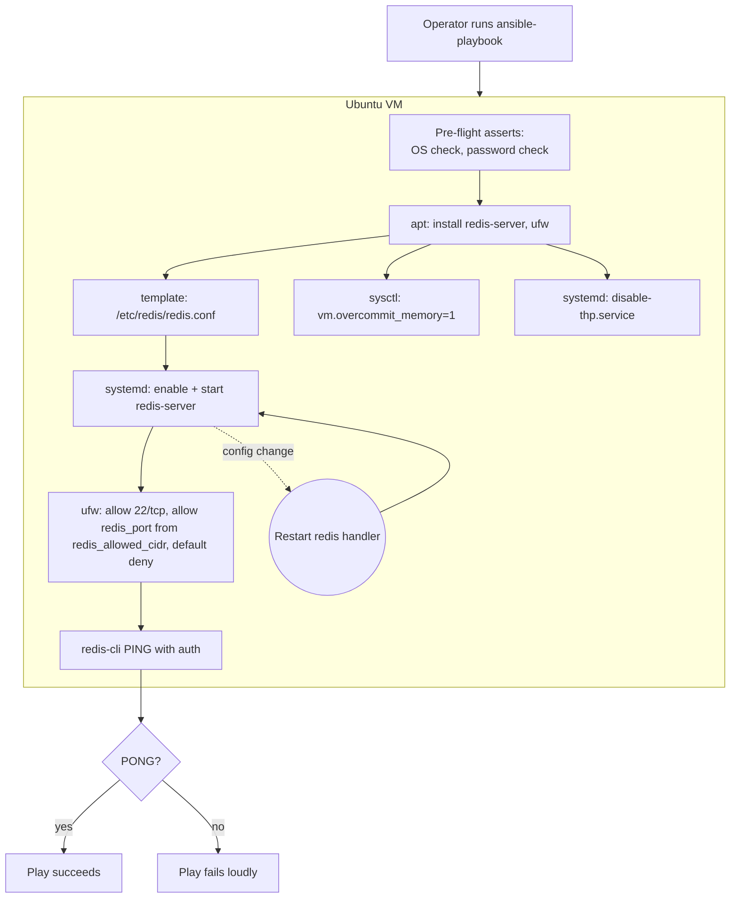

# Redis Cache Deployment on Ubuntu — Ansible Project Report

**Course:** Cloud Computing — Final Project
**Deliverable:** Infrastructure-as-Code playbook that provisions, secures,
and verifies a Redis cache on an Ubuntu VM.

---

## 1. Objective

Automate the deployment of a production-style Redis cache on an Ubuntu VM
using Ansible, so the entire setup is: repeatable (run it on any fresh
Ubuntu VM and get the same result), idempotent (safe to re-run), secured
by default (auth + network restriction, not just "install and hope"), and
verifiable (the playbook proves to itself that Redis actually works before
it reports success).

## 2. Architecture



The playbook is a single, linear play (no roles) because the scope is one
service on one host — introducing a roles/ directory here would be
over-engineering for what this project needs (YAGNI). Every task uses an
idempotent Ansible module (`apt`, `template`, `systemd`, `ufw`, `assert`),
never a raw shell command that would re-apply unconditionally on every run
— the two exceptions (`sysctl -p`, `redis-cli ping`) are explicitly guarded
with `when`/`changed_when` so they don't misreport "changed" on a repeat run.

## 3. Repository layout

```
ansible.cfg                       # inventory path, python interpreter, output format
inventory.ini                     # target: the Ubuntu VM (ansible_connection=local)
playbook.yml                      # the whole deployment, in dependency order
requirements.yml                  # community.general (ufw) + community.docker (test harness)
group_vars/all/vars.yml           # non-secret config: port, memory, CIDR, persistence
group_vars/all/vault.yml          # ansible-vault ENCRYPTED — contains redis_password only
group_vars/all/vault.yml.example  # documents the expected shape, not a real secret
templates/redis.conf.j2           # rendered to /etc/redis/redis.conf
templates/99-redis.conf.j2        # sysctl drop-in (vm.overcommit_memory)
templates/disable-thp.service.j2  # systemd oneshot unit, disables THP at boot
README.md                         # setup/run instructions
PROJECT_REPORT.md                 # this document
tests/                            # local verification harness (see tests/README.md)
```

## 4. Design decisions and rationale

| Decision | Why |
|---|---|
| **Password auth (`requirepass`) + bind to loopback and the VM's private IP** | Defense in depth: even if network controls fail, Redis itself refuses unauthenticated clients. Binding to the private IP (not `0.0.0.0`) means it's reachable from other hosts on the private network, but never from the public internet by default. |
| **Password stored only in `ansible-vault`-encrypted `vault.yml`** | Never commit secrets in plaintext. The encrypted file is safe to commit to git (that's the point of vault); only the vault *password* (`.vault_pass`, gitignored) must stay private. |
| **RDB persistence only, no AOF** | Matches project scope: point-in-time snapshots (`save 900 1`, `300 10`, `60 10000`) are sufficient for a cache workload where some data loss on crash is acceptable; AOF would add write-amplification and complexity not justified here. |
| **`maxmemory` + `allkeys-lru` eviction policy** | A cache should never OOM-kill the box or the process — bound its memory and let it evict least-recently-used keys instead of crashing. |
| **`ufw` firewall: default-deny, explicit allow for SSH (22/tcp) and Redis (`redis_port` from `redis_allowed_cidr`)** | Network-layer restriction on top of app-layer auth. SSH is explicitly allowed *first* so the play never locks out remote management. `redis_allowed_cidr` defaults to `127.0.0.1/32` (safe by default) — you must deliberately open it to a real subnet. |
| **`vm.overcommit_memory=1` and Transparent Huge Pages disabled** | Both are Redis's own upstream operational recommendations (see redis.io latency docs) — THP causes fork()-related latency spikes during background saves, and overcommit avoids fork() failing under memory pressure. Wiring these in demonstrates production-awareness, not just "apt install redis." |
| **Fail-fast pre-flight asserts (OS check, placeholder-password check)** | Fail with a clear message *before* touching the system, rather than partway through a botched run. Verified: running with the placeholder password aborts immediately (see §5). |
| **Final authenticated `PING` check inside the play itself** | The playbook doesn't just claim success because `systemctl start` returned 0 — it proves Redis actually answers, authenticated, before declaring victory. |
| **No roles/, single playbook** | One service, one host. A roles/ directory, group_vars per environment, etc. would be speculative generality for a project this size (YAGNI) — the moment this needs to manage more than one service or environment, that's the natural refactor point. |
| **`ansible_connection=local` in the real inventory** | Per project scope: Ansible runs directly on the target Ubuntu VM rather than over SSH from a separate control node. |

## 5. Verification — this was actually run, not just written

Ansible tooling isn't available on every grading machine, so rather than
asking you to trust the YAML, this playbook was executed end-to-end
against a real systemd-enabled Ubuntu 24.04 environment (a Docker
container built specifically to behave like a minimal VM — see
`tests/README.md` for exact reproduction steps and its limitations).

Results, independently checked with `docker exec` (not just Ansible's own
task output):

| Check | Result |
|---|---|
| `systemctl is-active redis-server` | `active` |
| `redis-cli ping` with **no** password | `NOAUTH Authentication required.` (correctly rejected) |
| `redis-cli -a <password> ping` | `PONG` |
| `grep ^bind /etc/redis/redis.conf` | `127.0.0.1 <private_ip>` |
| `grep ^appendonly` | `no` (RDB-only, as designed) |
| `grep maxmemory-policy` | `allkeys-lru` |
| `cat /sys/kernel/mm/transparent_hugepage/enabled` | `always madvise [never]` — THP genuinely disabled |
| `cat /proc/sys/vm/overcommit_memory` | `1` |
| `ufw status verbose` | `Default: deny (incoming)`; explicit allow only for `22/tcp` and `6379/tcp` from `127.0.0.1` |
| Re-running the full playbook | `changed=0` — fully idempotent, no spurious changes |
| Changing `redis_maxmemory` and re-running | `Restart redis` handler fired; `CONFIG GET maxmemory` returned `536870912` (512MB) post-restart |
| Running with a placeholder password (`CHANGE_ME`) | Play aborts on the pre-flight assert, before any system change |

This is meaningfully stronger evidence than a syntax check: it confirms
the config Ansible renders is the config Redis actually loads, that auth
is genuinely enforced, that the firewall rules genuinely apply, and that
the automation is safe to re-run.

## 6. How to deploy for real

1. Provision an Ubuntu 20.04+ VM (cloud provider of your choice, or a
   local VM/VirtualBox image) with `ansible-core` installed on it.
2. Copy this repository onto the VM.
3. `ansible-galaxy collection install -r requirements.yml`
4. `ansible-vault create group_vars/all/vault.yml` and set `redis_password`
   to a real generated password (see README.md).
5. Edit `group_vars/all/vars.yml`: set `redis_allowed_cidr` to whatever
   application server actually needs to reach Redis (defaults to
   loopback-only, i.e. nothing remote, until you change it).
6. `ansible-playbook playbook.yml --ask-vault-pass`
7. Confirm: `redis-cli -h <vm_private_ip> -p 6379 -a '<password>' ping` from
   an allowed host should return `PONG`; from a disallowed host it should
   time out (firewall) or be refused (auth).

## 7. Security checklist (for the write-up)

- [x] No hardcoded secrets — password lives only in an `ansible-vault`
      encrypted file (AES256).
- [x] Least-privilege network exposure — default-deny firewall, explicit
      allow list, safe-by-default CIDR (`127.0.0.1/32` until changed).
- [x] Application-layer authentication (`requirepass`) independent of the
      network layer — defense in depth, not either/or.
- [x] Config file permissions restricted (`0640`, owned by `redis:redis`)
      so other local users on the VM can't read the password out of
      `/etc/redis/redis.conf`.
- [x] Memory-bounded (`maxmemory` + eviction policy) to prevent
      resource-exhaustion failure modes.
- [x] Idempotent and safe to re-run — re-running never re-exposes a wider
      surface than intended and never silently drifts from the templated
      config.
- [x] Fail-fast input validation before any system mutation (OS check,
      credential check).

## 8. Possible extensions (explicitly out of scope here — YAGNI)

These would be reasonable next steps for a real production deployment,
but were deliberately left out to keep this project focused on what was
asked:

- TLS between clients and Redis (`tls-port`) — meaningful once traffic
  crosses untrusted network segments.
- Redis Sentinel/Cluster for high availability — meaningful once this
  cache is a single point of failure for something that can't tolerate one.
- A monitoring/alerting integration (Prometheus `redis_exporter`) — useful
  once this is a long-lived service someone is on-call for.
- Multi-environment inventories (`staging`, `prod` group_vars) — useful
  once there's more than one environment to manage.

## 9. Talking points for faculty Q&A

- **"Why Ansible over a shell script?"** Idempotency and declarative state
  — re-running a shell script that does `apt install` + `sed` in place
  tends to drift or fail on a second run; Ansible modules check current
  state before acting (demonstrated in §5: `changed=0` on re-run).
- **"How do you avoid hardcoding the password?"** `ansible-vault` — the
  password never exists in plaintext on disk or in git history; only the
  encrypted blob is committed, decrypted in memory at run time.
- **"What stops this from being just `apt install redis` with extra
  steps?"** The kernel tuning (§4) and the final authenticated verification
  step (§5) — both come from operating Redis in practice, not from the
  package's defaults.
- **"How did you test this without a cloud VM?"** A disposable,
  systemd-enabled Docker container standing in for a VM (§5, `tests/`) —
  genuine end-to-end execution, not a mock.
